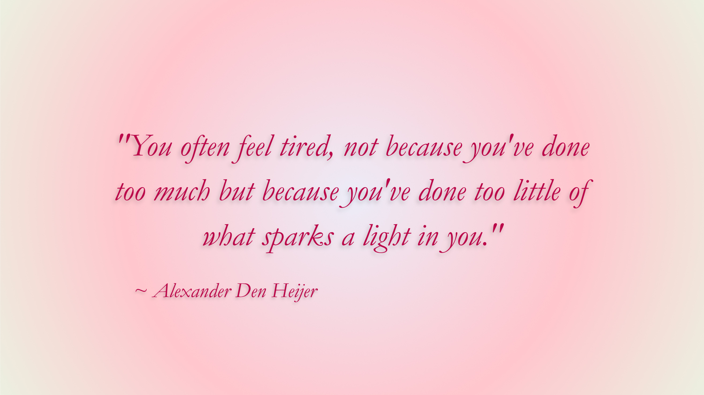

  <!-- Local Repository Banner Image -->
  

  

  <!-- Clean Hex #ffd9f0 Social Buttons -->
  
  
  
  

  <!-- Text Side (Takes up exactly half the width) -->
  

    Hi there! I'm Narayani Garg, a Computer Engineering student at NC State. I am incredibly passionate about bridging the gap between low-level hardware execution and clean, high-performance software logic. My engineering journey is driven by a love for problem-solving, structural optimization, and creating intuitive user experiences from the ground up. Right now, I am actively channeling this energy into developing a series of personal passion projects, tackling advanced technical coursework, and gaining hands-on industry experience through my current work opportunities. I love diving into complex system architectures, exploring new developer toolkits, and constantly expanding my skills as a full-stack builder and systems thinker.
  

  
  <!-- Image Side (Takes up exactly half the width) -->
  

    
  

 

---

## Technical Toolkit

### Front-End & Styling

  
  
  
  
  
  
  
  

### Back-End & Databases

  
  
  
  
  
  
  

### Intelligent Systems

  
  

### Hardware & Low-Level Systems

  
  
  
  
  
  

### Prototyping & Utilities

  
  
  
  
  

---

## My Activity

  <!-- Refined and color-coordinated visual metrics graphs -->
  
  

